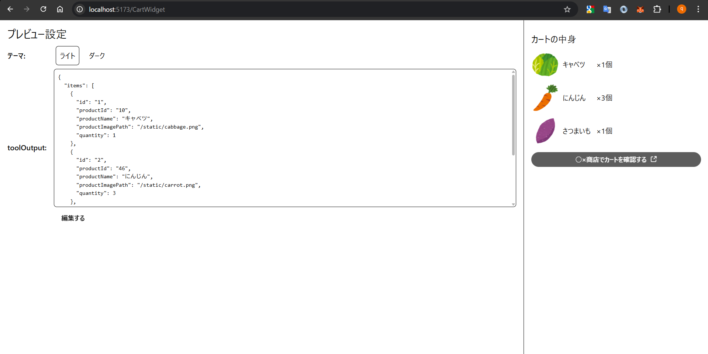

# 概要
https://www.cyberagent.co.jp/news/detail/id=32480


下記で自由に触ることができます。  
https://chatgpt-sample-app-481008.an.r.appspot.com


- ログインID  
  任意の文字列
- パスワード  
  1234Qwer

# ローカル開発
## ウィジェットの開発
src直下に置かれている`.tsx`で終わるファイルがそれぞれウィジェットです。新たなウィジェットを作成する場合は同じようにsrc直下に`.tsx`で終わるファイルを追加してください。

ウィジェットのソースは`window.openai`の情報をもとに`root`というidを持つDOM要素内にUIを描画するようなものである必要があります。

詳しくはウィジェット実装や[Apps SDKのドキュメント](https://developers.openai.com/apps-sdk/build/chatgpt-ui#author-the-react-component)をご覧ください。

### ウィジェットのプレビュー
下記のコマンドでウィジェットのプレビューサーバーが立ち上がります。プレビューではライト/ダークモードでどのようにウィジェットが見えるか確認することができます。
```bash
cd widget
npm i
npm run dev
```



ウィジェットのプレビューに必要なwindow.openaiのデータは`widget/src/content/XxxxMockInitializer.ts`で自由に定義することができます。

### ウィジェットのビルド
下記のコマンドでウィジェットをビルドすることができます。chatgptのiframeにそのまま埋め込むことが可能なHTMLファイルが`widget/dist`配下に生成されるので、それらをそのままMCPのresourceに含めることができます。
```bash
cd widget
npm run build
```

## サーバー側の開発
サーバー側はとある