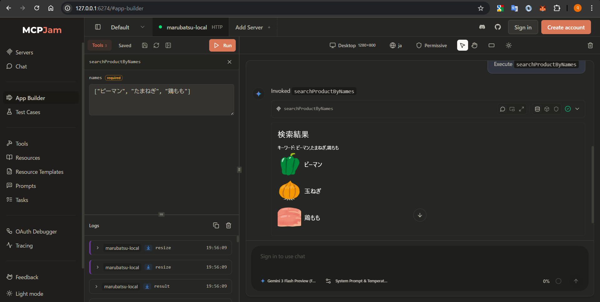

# 概要
下記で自由に触ることができます。  
[https://chatgpt-sample-app-481008.an.r.appspot.com](https://chatgpt-sample-app-481008.an.r.appspot.com)

- ログインID  
  任意の文字列
- パスワード  
  1234Qwer

# ローカル開発
## ウィジェットの開発
`widget/`直下に置かれている`.html`で終わるファイルがそれぞれウィジェットです。新たなウィジェットを作成する場合は同じように`widget/`直下に`.html`で終わるファイルを追加してください。

ウィジェットのソースは`window.openai`の情報をもとにUIを描画するようなものである必要があります。

詳しくはウィジェットの実装や[Apps SDKのドキュメント](https://developers.openai.com/apps-sdk/build/chatgpt-ui#author-the-react-component)をご覧ください。

### ウィジェットのプレビュー
下記のコマンドでウィジェットのプレビューサーバー（[http://localhost:5173](http://localhost:5173)）が立ち上がります。プレビューではライト/ダークモード、toolInput、toolOutputを設定しインタラクティブにウィジェットの見た目の確認をすることができます。
```bash
cd widget
npm i
npm run dev
```


ウィジェットのプレビューに必要なwindow.openaiのデータは`widget/XXXX.mock.json （XXXXはhtmlの拡張子より前の部分）`で自由に定義することができます。

### ウィジェットのビルド
下記のコマンドでウィジェットをビルドすることができます。chatgptのiframeにそのまま埋め込むことが可能なHTMLファイルが`widget/dist`配下に生成されます。
```bash
cd widget
npm run build
```

## サーバーの開発
Expressで作られたシンプルなサーバーです。
MCPエンドポイント（OAuth リソースサーバー）、認証エンドポイント（OAuth 認証サーバー）、簡単なUIなどを備えています。
お遊び半分のプロジェクトなのでDBなどの外部ミドルウェアに何も依存しておらず、インメモリで動きます。

### ローカル実行
※サーバー実行時にウィジェットのビルド済みコードを読む必要があるため、先にウィジェットのビルドを行ってからサーバーの実行をしてください。

下記のコマンドでサーバー（[http://localhost:3000](http://localhost:3000)）が立ちあがります。
サーバーのログにテスト用のアクセストークンが表示され、これをmcpエンドポイントの認証（ユーザーID: TEST1111）に使うことができます。

```bash
cd server
npm i
npm run dev
```

## サーバーのビルド
下記のコマンドでサーバーをビルドすることができます。ビルドされたファイルは`dist/`配下に生成されます。

```bash
cd server
npm run build
```

# ローカルでの動作確認
[MCPJam Inspector](https://github.com/MCPJam/inspector)というツールを利用することで、デプロイ & ChatGPTでアプリ作成しなくても、ChatGPTアプリの結合動作確認をすることができます。

詳しくはMCPJam InspectorのGitHubをご覧ください。



# デプロイ
一応GCP App Engineにデプロイするためのスクリプトを用意しています。（あまり動作検証はしていません）

スクリプト実行前にgcloud CLIをインストール・認証する必要があります。

```bash
# スクリプトをコピー
cp deploy.sh.template deploy.sh

# スクリプト冒頭のSERVER_BASE_URL、WIDGET_IFRAME_ORIGIN、GCP_PROJECT_IDに適切な値を記載する
vim deploy.sh

chmod +x deploy.sh

./deploy.sh
```

# ChatGTP上でアプリを利用する方法
詳細な手順は[ChatGPTのドキュメント](https://developers.openai.com/apps-sdk/deploy/connect-chatgpt)をご覧ください。

「MCPサーバーのURL」は「[https://chatgpt-sample-app-481008.an.r.appspot.com/mcp](https://chatgpt-sample-app-481008.an.r.appspot.com/mcp)」、「認証」は「OAuth」です。

インスタンスはアクセスが無いとシャットダウンされメモリの内容が失われるため、一度作成したアプリをしばらくしてから再度使おうとすると○×商店の認証画面に再度飛ばされます。が、OAuthクライアント情報も失われているので「Invalid Client ID」といったエラーが表示されます。

（他のMCPクライアントだとclientIdを保存せず都度新しいクライアントを登録してくるものもあるので、その場合はエラーは表示されません。）

引き続きChatGPT上でアプリを利用したい場合は、一度アプリを削除し再度登録して下さい。